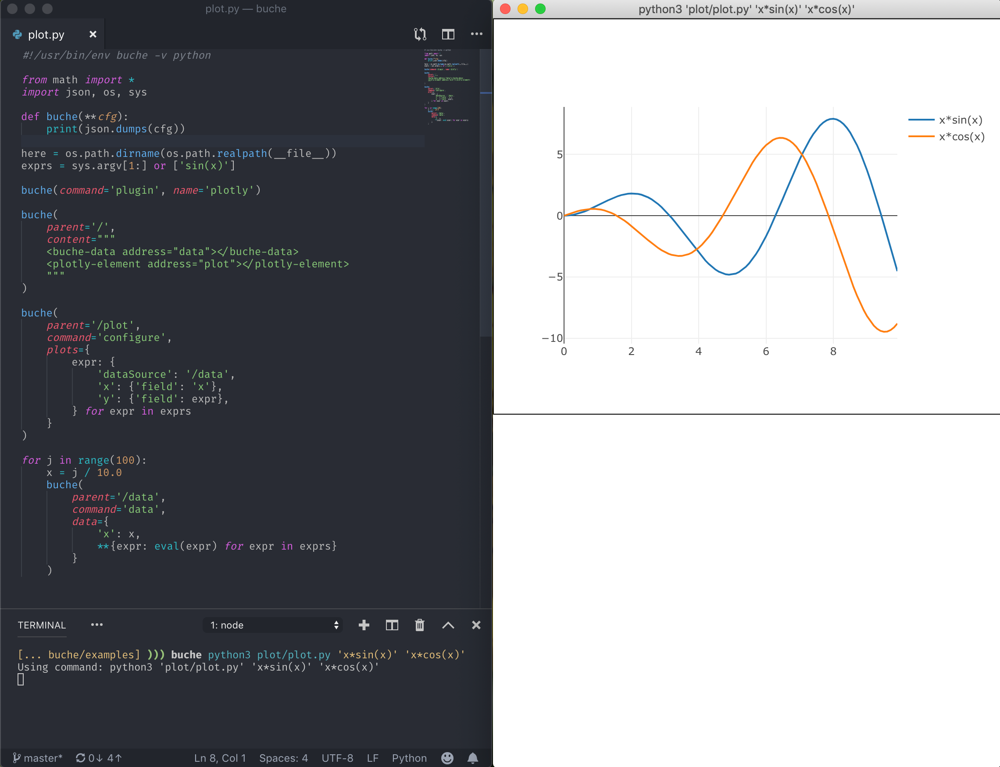

# What is buche?

Buche is a language-agnostic, serverless, extensible HTML "logger". No matter what language you are using, with only a little bit of code, it can do a lot of things:

* Display log entries in HTML and Markdown.
* Live plots.
* Live graphs.
* Simple interactive interfaces like REPLs.

Here's why you might want to use it:

* **Only stdout**: All you need to know to use `buche` is how to print JSON.
* **Serverless**: You don't need to start a server or to connect to a server. Just write `buche <command> ...`
* **Learn by example**: If you want to reproduce an existing command's output, just look at the JSON commands it prints (also: `buche --inspect`).
* **Extensible**: It is possible to define new channel types and new components, and plugins can be installed directly through the UI!
* **Easy to use over ssh**: `buche <command>` => `buche ssh <machine> <command>`. It just works.

A lot of Buche's advantages boil down to the first point: Buche works on a stream of JSON commands, and uses `stdin` and `stdout` as its interface. This means you can take everything you know about manipulating these streams, everything you know about manipulating plain files, and leverage that to make Buche do what you want.

For example, you can save a command's output in a file, and play it back to Buche. If you have results in multiple files, you can merge them in a single Buche window as simply as `buche cat <file1> <file2> ...`. You can use `jq` or even `grep` to filter interesting parts, `sed` or `awk` for simple tweaks, etc. You can connect Buche to a fifo and funnel multiple commands into it. You can also write your own middleware to transform JSON streams in whatever way is useful to you.



## Install

For the time being, Buche must be installed through `npm`:

```bash
npm install buche -g
```

There will be self-contained packages in the future, when the tool is more stable.

To install plugins, you can write:

```bash
buche --install <plugin-name>
```

It is usually not necessary to do it on the command line, however. If a program outputs the `require` command to require a plugin, Buche will prompt the user to install it if it cannot be found.

## Use

Buche takes commands from stdout and (when applicable) outputs commands on stdin. This means you can simply pipe your application to buche: `<command> | buche` (if you have no need for stdin) or you can have buche run the command for you: `buche <command>`. (Note: in a script, you can use the shebang `#!/usr/bin/env buche <language>` to make the shell invoke buche when executing the script).

The best way to learn how to use Buche is by example: take a program that does something you would like to do, and either inspect its code, or inspect its output (which should be pretty simple most of the time). For this purpose, the `--inspect` flag makes buche print out all the commands that are exchanged between it and a program, in the following format: `-> <command_to_buche>` and `<- <command_from_buche>`. The former is what you should print, the latter is what you should parse and respond to (but don't worry too much about that, because it is only relevant if you want to write an interactive application).

## Examples

There are several simple examples in this repository to get you started. They are [here](https://github.com/breuleux/buche/tree/master/examples). You can also clone the repository to get to them:

```bash
git clone https://github.com/breuleux/buche
cd buche/examples
./demo.py
```

Each example is executable and uses the `--inspect` flag to show you the example's output stream. Executing an example works simply because the shebang in the file invokes `buche`, and you can look at it with `head -1 example`. It's all very simple. The code for most of the examples easily fit on a screen.

Some Buche functionality and channels are not in any examples yet, unfortunately, but that will come.

## Language support

This section contains advice about how to best use Buche with various programming languages. In general, it is possible to use it with any language without any specific support, but there are sometimes a few tricks to remember, and some languages may have libraries to make everything even easier.

### Python

**IMPORTANT:** By default, Python will buffer its output when it isn't directly outputting to a tty. That means the logging will be choppy, not very responsive, and might not even happen before the command is completely done executing. To solve this, pass the `-u` flag to `python`: instead of writing `buche python <file>`, write `buche python -u <file>`.

**Package:** There is a `buche` package for Python >= 3.6 which you can install with `pip install buche`. `buche` gives a nicer syntax to open channels, log into them, and notably provides a `buche(object)` function that pretty-prints Python objects as HTML. These objects can also be interacted with by clicking on them. See [here](https://github.com/breuleux/pybuche) for documentation on the package. It is recommended to run `examples/pyrepl_nice.py` (in this repository) for a demonstration.

## Plugins

Install a plugin:

```bash
buche --install <plugin-name>
```

To use a plugin, you must either use the `-r <plugin-name>` flag or have your program print out a `require` command prior to opening channels or using components defined by the plugin. The latter is preferred, but the former can be useful if the `require` command is being filtered out somehow. You can tell `buche` to show you the JSON command your program needs to print out. Either of the following commands will do:

```bash
buche -hr <plugin-name>
buche --dump -r <plugin-name>
```

You can simply copy paste the output into a string in your program and print it before anything else. You can also edit it to turn off or rename some of the features if you need to (which is probably never).

## Stability

There is no stable release of Buche at the moment and the interface and commands may still change. Some capabilities may be removed in order to enhance security, such as the ability to inject scripts with full permissions in the output stream. Suggestions are welcome.

## Writing extensions

TODO.

Still, if you feel motivated, you can look at [buche-cytoscape](https://github.com/breuleux/buche-cytoscape) and [buche-bokeh](https://github.com/breuleux/buche-cytoscape) to get a general idea of how to write an extension. The extension can be loaded directly:

```json
{"command":"require", "path":"/", "pluginPath":"path/to/entry/point.js"}
```

Which is practical for development, or for really specialized extensions you only need for one project. It can require npm packages as needed. Otherwise, if you publish a plugin named `buche-xyz` on npm, it can be required like this:

```json
{"command":"require", "path":"/", "pluginName":"xyz"}
```

Note: these plugins are installed in `~/.config/buche/node_modules`.

## More screenshots

Because you won't know what you want until you see it.

Graphs:


Simple Python REPL:


Shiny Python REPL:


Merging the outputs of several commands (shift-click on tabs to do the split screen):


