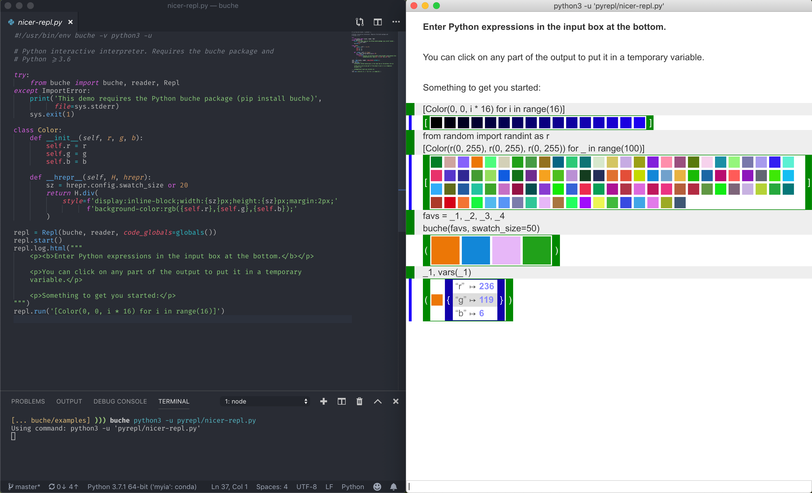

# What is buche?

[**Download**](https://github.com/breuleux/buche/releases/latest)

Buche is a language-agnostic, serverless, extensible HTML "logger". No matter what language you are using, with only a little bit of code, it can do a lot of things:

* Display log entries in HTML and Markdown.
* Live plots.
* Live graphs.
* Simple interactive interfaces like REPLs.

Here's why you might want to use it:

* **Only stdout**: All you need to know to use `buche` is how to print JSON.
* **Serverless**: You don't need to start a server or to connect to a server. Just write `buche <command> ...`
* **Learn by example**: If you want to reproduce an existing command's output, just look at the JSON commands it prints (also: `buche --inspect`).
* **Extensible**: It is possible to define new channel types and new components, and plugins can be installed directly through the UI!
* **Easy to use over ssh**: `buche <command>` => `buche ssh <machine> <command>`. It just works.

A lot of Buche's advantages boil down to the first point: Buche works on a stream of JSON commands, and uses `stdin` and `stdout` as its interface. This means you can take everything you know about manipulating these streams, everything you know about manipulating plain files, and leverage that to make Buche do what you want.

For example, you can save a command's output in a file, and play it back to Buche. If you have results in multiple files, you can merge them in a single Buche window as simply as `buche cat <file1> <file2> ...`. You can use `jq` or even `grep` to filter interesting parts, `sed` or `awk` for simple tweaks, etc. You can connect Buche to a fifo and funnel multiple commands into it. You can also write your own middleware to transform JSON streams in whatever way is useful to you.


## Install

Packages and binaries for Mac/Linux can be downloaded on the [**latest release**](https://github.com/breuleux/buche/releases/latest) page.

You can also install `buche` with `npm`:

```bash
npm install buche -g
```

To install plugins, you can write:

```bash
buche --install <plugin-name>
```

It is usually not necessary to do it on the command line, however. If a program outputs the `require` command to require a plugin, Buche will prompt the user to install it if it cannot be found.

## Use

Buche takes commands from stdout and (when applicable) outputs commands on stdin. This means you can simply pipe your application to buche: `<command> | buche` (if you have no need for stdin) or you can have buche run the command for you: `buche <command>`. (Note: in a script, you can use the shebang `#!/usr/bin/env buche <language>` to make the shell invoke buche when executing the script).

The best way to learn how to use Buche is by example: take a program that does something you would like to do, and either inspect its code, or inspect its output (which should be pretty simple most of the time). For this purpose, the `--inspect` flag makes buche print out all the commands that are exchanged between it and a program, in the following format: `-> <command_to_buche>` and `<- <command_from_buche>`. The former is what you should print, the latter is what you should parse and respond to (but don't worry too much about that, because it is only relevant if you want to write an interactive application).

## Commands

Here is how buche commands work:

* The command must be formatted as JSON and must be all on a single line (no pretty printing).
* Except for the commands `template`, `redirect`, `resource` and `plugin`, all commands must specify a `parent`.
* The `parent` is typically some DOM element. Plugins can define custom components that answer to custom commands.
* Defining the `address` attribute on an element is required to make it addressable. Read about the `log` command below for more information on how this works.

### `log`

The simplest command is `log`, which you can omit since it is the default. Log takes some HTML content and dumps it in the specified element. For example, this adds a div to the root element:

```json
{"parent": "/", "command": "log", "content": "<div>Hello!</div>"}
```

Other elements can be reached through their address. For example:

```json
{"parent": "/", "command": "log", "content": "<div address=\"above\">Above</div><div address=\"below\"></div>"}
{"parent": "/above", "command": "log", "content": "<b address=\"nested\">Hello</b>"}
{"parent": "/below", "command": "log", "content": "<b>World</b>"}
{"parent": "/above/nested", "command": "log", "content": ", beautiful"}
```

This will display, incrementally, the following HTML:

```html
<div>Above <b>Hello, beautiful</b></div>
<div>Below <b>World</b></div>
```

Notice that addresses are relative: when we add the element with address `nested` to the element with address `/above`, the address of that element becomes `/above/nested`. It is possible to define an element with an absolute address by prepending it with a `/`, so the address for `<div address="/notnested"></div>` is `/notnested` regardless of where you put it.


### `eval`

`eval` evaluates some JavaScript in the context of the specified parent. For example, this sets the focus on the element at `/myinput`:

```json
{"parent": "/myinput", "command": "eval", "expression": "this.focus()"}
```


### `resource`

The `resource` command does not have a parent. It simply adds a resource in the document's `<head>`. For example:

```json
{"command": "resource", "content": "<style>.myclass {color: red}</style>"}
```

Anything you can put in `<head>` will work here.


### `plugin`

The `plugin` command imports a plugin. It does not have a parent. If the plugin contains a slash, it will be interpreted as a path and the plugin will be fetched on the filesystem. Otherwise, buche will try to import the plugin from its global cache.

```json
{"command": "plugin", "name": "cytoscape"}
{"command": "plugin", "name": "./index.js"}
```

If the plugin is not found, try installing it with `buche --install <name>`, e.g. `buche --install cytoscape`.


### `redirect`

The `redirect` command redirects an address to another. This is mostly useful to redirect `/stdout` and `/stderr`, which by default go to separate tabs from the root element `/`. Example:

```json
{"command": "redirect", "from": "/stdout", "to": "/"}
```


### `template`

The `template` command, if provided, must be the *first* command. Either `src` or `content` can be used:

```json
{"command": "template", "src": "my-template.html"}
{"command": "template", "content": "<div class=\"root\" address=\"/\">...</div>"}
```

The template should define an element with address `/` and may also define `/stdout`, `/stderr` and `/buche/errors`, which is where Buche will respectively put non-json lines on stdout, non-json lines on stderr, and various errors such as a `log` command without a parent. Note that Buche will still make sure all of these exist even if they are not in the template, so that nothing is accidentally thrown away.


## Examples

There are several simple examples in this repository to get you started. They are [here](https://github.com/breuleux/buche/tree/master/examples). You can also clone the repository to get to them:

```bash
git clone https://github.com/breuleux/buche
cd buche/examples
./demo/demo.py
```

Each example is executable and uses the `--inspect` or `-v` flag to show you the example's output stream. Executing an example works simply because the shebang in the file invokes `buche`, and you can look at it with `head -1 example`. It's all very simple. The code for most of the examples easily fit on a screen.

Some Buche functionality and channels are not in any examples yet, unfortunately, but that will come.

## Language support

This section contains advice about how to best use Buche with various programming languages. In general, it is possible to use it with any language without any specific support, but there are sometimes a few tricks to remember, and some languages may have libraries to make everything even easier.

### Python

**IMPORTANT:** By default, Python will buffer its output when it isn't directly outputting to a tty. That means the logging will be choppy, not very responsive, and might not even happen before the command is completely done executing. To solve this, pass the `-u` flag to `python`: instead of writing `buche python <file>`, write `buche python -u <file>`.

**Package:** There is a `buche` package for Python >= 3.6 which you can install with `pip install buche`. `buche` gives a nicer syntax to open channels, log into them, and notably provides a `buche(object)` function that pretty-prints Python objects as HTML. These objects can also be interacted with by clicking on them. See [here](https://github.com/breuleux/pybuche) for documentation on the package. It is recommended to run `examples/pyrepl_nice.py` (in this repository) for a demonstration.

## Plugins

Install a plugin with this command:

```bash
buche --install <plugin-name>
```

To use a plugin, you must have your program print out a `require` command prior to using components defined by the plugin.


## Stability

There is no stable release of Buche at the moment and the interface and commands may still change. Some capabilities may be removed in order to enhance security, such as the ability to inject scripts with full permissions in the output stream. Suggestions are welcome.

## Writing extensions

TODO.

Still, if you feel motivated, you can look at [buche-cytoscape](https://github.com/breuleux/buche-cytoscape) and [buche-bokeh](https://github.com/breuleux/buche-cytoscape) to get a general idea of how to write an extension.

Essentially, you want to define one or more custom components, and then various `command_<name>` methods for any commands you want your component to understand.

Note: these plugins are installed in `~/.config/buche/node_modules`.

## More screenshots

Because you won't know what you want until you see it.

Graphs:


Simple Python REPL:


Shiny Python REPL:



(If you're wondering, the [hrepr](https://pypi.org/project/hrepr/) package handles the pretty printing. It was written for Buche but it will also work in Jupyter, minus the ability to put objects in variables by clicking on their representation)

Merging the outputs of several commands in the same window:


